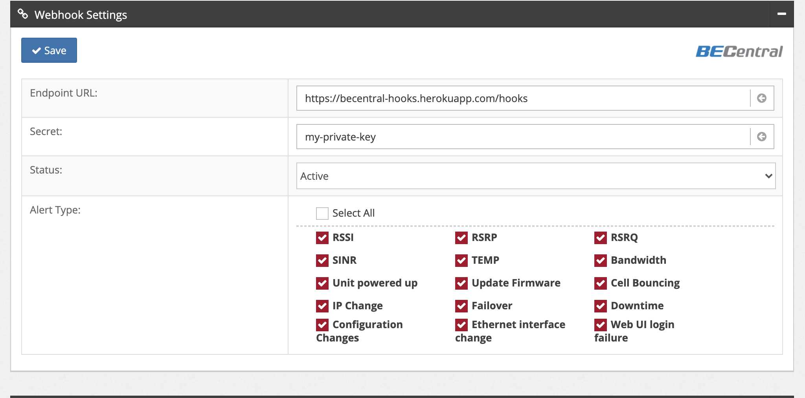
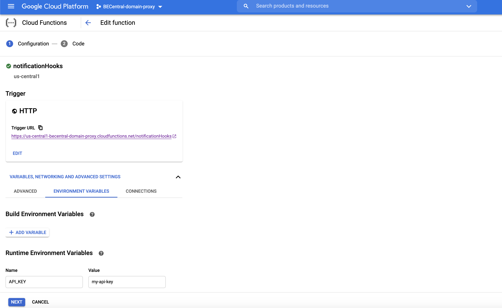
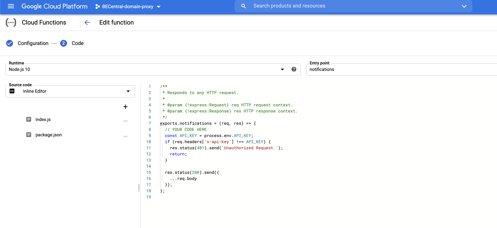

# How to set up webhook for BECentral notifications stream

#### it's generally a three-step process:

1. Create the webhook URL (RESTful APIs, serverless function,..) from your application you want to send data to.
2. Use that URL in the webhook settings on BECentral (Account > Profile > Webhook Settings)

3. Input your secret key (For your own request verification)
4. Choose the type of alerts you want BECentral to notify you about

### To show you how this works, we'll provide you 2 example

[x] HTTP server using NodeJs + ExpressJs (You can take a look at this github repo)

```
app.post('/hooks/notifications', (req, res) => {
  if (req.headers['x-api-key'] !== process.env.API_KEY) {
    res.status(401).send('Unauthorized Request.');
    return;
  }

  res.json({
    ...req.body,
  });
});
```
---

[x] Cloud Functions (Serverless) on Google Cloud Platform
- Cloud Functions settings

- Cloud functions implementation

